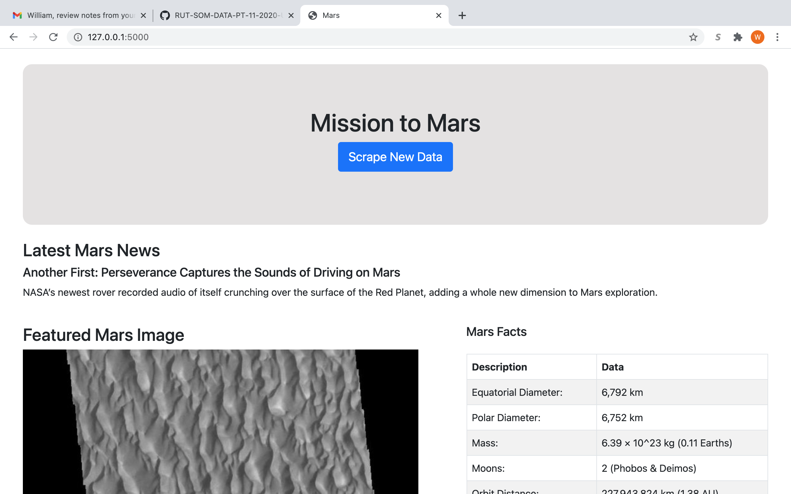
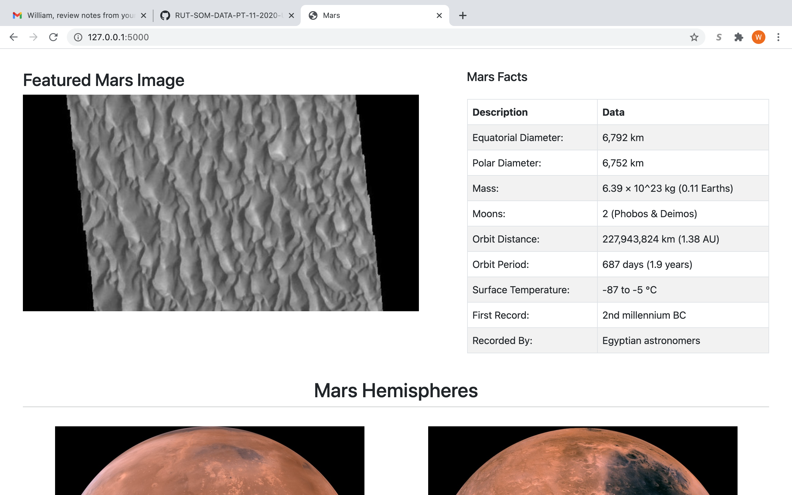
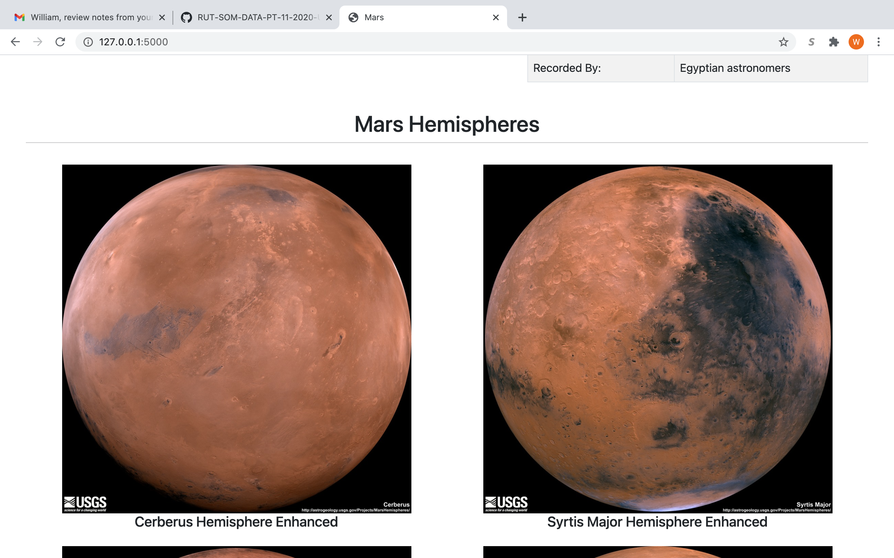
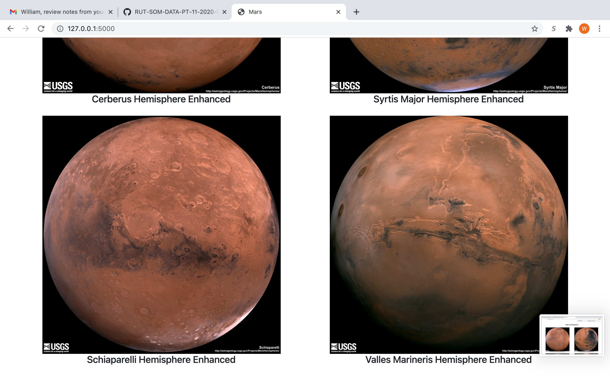

# Scraping Mars
This repository contains a web application that contains information and data related to the Mission to Mars via scraping various websites containing information about Missions to Mars. The work began in the the Mission to Mars jupyter notebook file, where I used the python library Beautiful Soup to scrape various webpages to get the information about Mars that I wanted. I then took these functions and put them into a file called "scrape_mars.py". After this, I made a file called "app.py" that would utilize Flask to set up a webpage where one could retrieve and view all the information about Mars. The user simply has to click a button on the webpage and all the scraping functions will be run, the information obtained was stored in Mongo DB, and then the information was displayed on the webpage in a way that was more visually appealing to the reader. Examples of how the webpage would finally look can be seen below.

This first screen shot contains the title of the webapp as well as the button called "scrape new data". The user clicking this button will be result in all the information seen in this screenshot appearing on the webapp. This screenshot also shows the first section of the scraped information which is the title of the latest headline about NASA's missions to Mars, as well as a short summary blurb telling what the article is about. The next screenshot will show the next part of the the scraped data, which is the most recent featured Mars image and a table containing basic interesting facts about the planet Mars.

The next two screenshots contain the last section of scraped data, which are photos and titles of each of Mar's four hemispheres.

